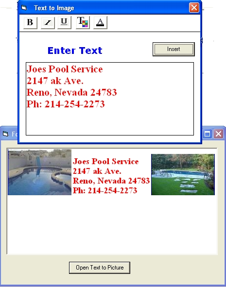



## TextToPicture

### Description

When adding images to a RichTextBox ever notice you can only add text to the same line at the bottom side of a picture. Fill in that blank space next to pictures with formated text in a RichextBox. This takes the formated text you type and adds it as picture at your cursor position.
 
### More Info
 

             |
---                |---
**Submitted On**   |2007-09-25 16:37:26
**By**             |[Robert Moore](https://github.com/Planet-Source-Code/PSCIndex/blob/master/ByAuthor/robert-moore.md)
**Level**          |Intermediate
**User Rating**    |5.0 (10 globes from 2 users)
**Compatibility**  |VB 6\.0
**Category**       |[Custom Controls/ Forms/  Menus](https://github.com/Planet-Source-Code/PSCIndex/blob/master/ByCategory/custom-controls-forms-menus__1-4.md)
**World**          |[Visual Basic](https://github.com/Planet-Source-Code/PSCIndex/blob/master/ByWorld/visual-basic.md)
**Archive File**   |[TextToPict2084669252007\.zip](https://github.com/Planet-Source-Code/robert-moore-texttopicture__1-69395/archive/master.zip)

